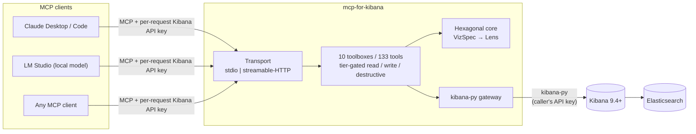
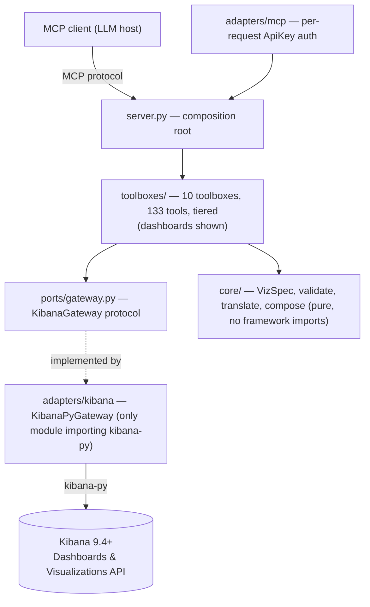
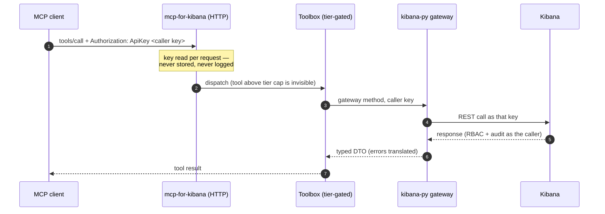
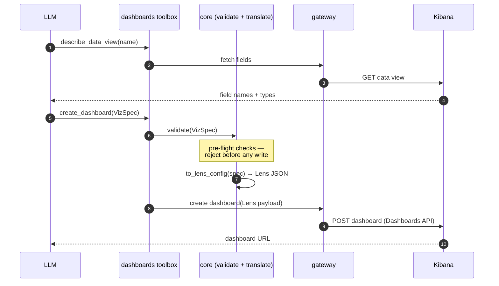

# Architecture

This page describes the system at three levels: the **system context** (who talks
to what), the **internal layering** (hexagonal ports-and-adapters), and the two
key **runtime flows** (per-request auth and the VizSpec → Lens path), each as a
diagram-as-code so it stays reviewable and versioned alongside the code.

## System context

Where mcp-for-kibana sits between an LLM host and a Kibana deployment. One process per
user in stdio mode; a shared stateless process in HTTP mode, where every request
carries the caller's own Kibana API key.



## Hexagonal layers

mcp-for-kibana is built as ports-and-adapters (hexagonal architecture): a pure
domain core in the middle, with the MCP protocol on the driving side and
Kibana on the driven side, connected only through explicit interfaces. The
layering is not just a diagram — it's machine-enforced by
[import-linter](https://import-linter.readthedocs.io/) contracts in
`pyproject.toml`, checked in CI (`uv run lint-imports`):



The layer contract (`[[tool.importlinter.contracts]]`, `type = "layers"`)
orders modules top to bottom as: `server` → `toolboxes` → `adapters` →
`ports` → `core | config`. A higher layer may import a lower one; the
reverse is a lint failure. Two more contracts sharpen this:

- **Core and ports are pure of frameworks** — `core`, `ports`, and `config`
  may not import `fastmcp`, `mcp`, or `kibana` at all. The domain logic
  (VizSpec, validation, Lens translation, dashboard composition) has zero
  knowledge that it's running inside an MCP server talking to Kibana; it's
  independently unit-testable with no fakes for either.
- **`kibana-py` only inside `adapters.kibana`** — `toolboxes` and
  `adapters.mcp` are forbidden from importing the `kibana` package
  directly. Toolbox code only ever sees `ports.gateway.KibanaGateway`, an
  abstract `Protocol`; the concrete `KibanaPyGateway` implementation
  (`adapters/kibana/gateway.py`) is the *only* module in the codebase
  allowed to import `kibana-py`, injected into toolboxes at startup via a
  `gateway_factory` callable (`server.py`'s `main()` constructs it, `build_server`
  threads it through as `ToolboxDeps.gateway_factory`). Swapping the Kibana
  client library, or adding a fake for tests, touches exactly one module.
- **`server` may not import `kibana` directly** (`allow_indirect_imports =
  true`, so it can still depend on it transitively through `toolboxes`/
  `adapters` — the point is the composition root never talks to Kibana
  itself, it only wires the pieces that do).

## Toolboxes

A **toolbox** is a vertical slice of related tools that registers itself
onto the server (`Toolbox` protocol, `toolboxes/base.py`):

```python
class Toolbox(Protocol):
    name: str
    def register(self, mcp: FastMCP, deps: ToolboxDeps) -> None: ...
```

`toolboxes/__init__.py` holds the registry (`TOOLBOXES: dict[str,
Toolbox]`) — ten toolboxes today (`dashboards`, `data-management`,
`alerting`, `cases`, `platform-health`, `observability`,
`security-detections`, `platform-admin`, `streams`, `fleet` — 133 tools in
all). Deployment
config (`KIBANA_MCP_TOOLBOXES`, see
[Configuration](configuration.md#toolbox-selection)) picks which entries to
register; an unknown name fails startup loudly rather than silently
omitting tools. This is the mechanism behind the **composable toolboxes**
pillar: a small local model can be handed a narrower tool surface (fewer
toolboxes, or a capped [tier](configuration.md#tier-semantics)) than a
larger model, purely through configuration — no code branches on model
identity anywhere in the server.

Within a toolbox, tools are further split by **tier** (`read` / `write` /
`destructive`), tagged accordingly, and gated at startup via FastMCP's
tag-based visibility API rather than a runtime permission check — see
[Tool reference](tools.md#tiers-and-annotations) for the full mechanics.

## Request lifecycle & per-request auth

The server is stateless: it stores no Kibana credentials. In HTTP mode each caller
sends their own API key in the `Authorization` header on every request; the server
reads it per request, uses it for that call, and never persists or logs it — so
Kibana RBAC and audit logging stay per-user. (In stdio mode the single local
user's key comes from the environment instead.)



## In-band documentation resources

Beyond the site you're reading, the running server self-serves selected
docs as read-only MCP resources — `docs://user-guide`, `docs://tools`, and
`docs://troubleshooting` — so any connected agent (LM Studio, Claude Code,
…) can read the manual mid-session, without internet access or a repo
checkout. Registration is server-level in `build_server`
(`server.py`'s `_register_docs_resources`), not toolbox-level: resources
are read-only by nature, so the read/write/destructive
[tier gating](configuration.md#tier-semantics) that hides tools does not
apply to them — they're always visible.

`docs/user-guide.md` and `docs/tools.md` stay the single source of truth in
git; `kibana_mcp/adapters/mcp/docs_resources.py` is a stdlib-only loader
that reads the wheel-bundled copy under `kibana_mcp/_docs/*.md` (placed
there at build time by hatch `force-include`, see `pyproject.toml`) and
falls back to a repo-relative read for editable/dev installs.
`docs://troubleshooting` is the user guide's Troubleshooting section,
extracted by heading at read time, with a tolerant fallback to the whole
guide if the heading is ever missing.

## VizSpec → Lens translation

The single hardest problem this project solves is letting a model describe
a chart in a handful of guessable fields, while Kibana's actual Lens API
payloads are deeply nested, chart-type-specific JSON that varies in shape
between an XY chart, a pie, a metric card, and a table. The core module
`core/visualizations/translate.py` owns **all** knowledge of that payload
shape — its own docstring states the invariant: *"nothing else in the
codebase may build Lens JSON."*

The flagship **read → validate → translate → write** flow, end to end:



`to_lens_config(spec: VizSpec) -> dict` pattern-matches on `chart_type` and
builds the right shape:

- `line` / `area` / `bar` → an `"xy"` config with a single `layers` entry
  carrying `x` (the first `group_by`, bucketed), `y` (the metrics), and
  optionally `breakdown_by` (a second `group_by`, for a series split);
  `bar` with a breakdown switches its layer `type` to `"bar_stacked"`.
- `pie` → `"pie"` with one `metrics` entry and `group_by` as slice
  dimensions.
- `metric` → `"metric"` with the first metric marked `"type": "primary"`
  and any further metrics as `"secondary"`.
- `table` → `"data_table"` with `metrics` as columns and `group_by` as
  `rows`.
- `gauge` / `heatmap` / `tag_cloud` / `region_map` / `mosaic` / `treemap` /
  `waffle` → each type's own config whose dimension **key names are not
  uniform** (e.g. `gauge`/`tag_cloud`/`region_map`/`mosaic` take a singular
  `metric`; `treemap`/`waffle` take a plural `metrics`; the bucket key varies:
  `tag_by`, `region`, `x`+`y`, `group_by`). Every shape was pinned by probing a
  live Kibana 9.4.3 rather than read off the OpenAPI spec, and is contract-tested
  against a running stack — the contract tests are the authority here.

Each aggregation (`MetricSpec`) and bucket (`GroupBySpec`) becomes an
"operation" dimension (`{"operation": "average", "field": "..."}`,
`{"operation": "date_histogram", "field": "..."}`, …), and filters become a
single KQL expression ANDed together (`kql_expression`).

**Why this knowledge lives entirely server-side:** the model never
constructs Lens JSON — it only ever fills in the flat `VizSpec` (chart
type, fields, groupings, filters). That's a deliberate reliability choice,
not just a convenience: local, smaller models are unreliable at producing
correct deeply-nested, schema-specific JSON on the first try, but are
reliable at filling a flat schema from a data-view field listing. Moving
all Lens-shape knowledge into one server-side module means a Kibana API
shape change is a one-file update, not a prompt-engineering problem, and
the E2E gate's 3/3 pass with a 20B local model
([Testing & E2E](e2e-setup.md)) is direct evidence the flat-input design
works in practice.

## The dropped-panel guard

`add_panel`, `update_panel`, and `delete_panel` all modify an *existing*
dashboard by reading its current data, changing one part, and writing the
whole thing back (there is no partial-update API for individual panels).
That read-modify-write is unsafe if the dashboard contains anything the
Dashboards API can't fully round-trip — Kibana panel types outside the
Technical Preview API's coverage (maps, ML panels, …), or top-level
dashboard fields the update endpoint doesn't accept.

Two checks feed this guard, both in `adapters/kibana/gateway.py`'s
`get_dashboard_data`:

1. Any `warnings` Kibana's own response includes are surfaced as-is.
2. `_UPDATABLE_KEYS` is the frozen set of top-level dashboard fields the
   update API actually accepts (`title`, `description`, `panels`,
   `options`, `filters`, `query`, `time_range`, `refresh_interval`, `tags`,
   `pinned_panels`). Any field on the fetched dashboard *outside* that set
   is flagged as a warning — because `update_dashboard` filters its
   payload down to exactly `_UPDATABLE_KEYS` before sending it, so an
   unlisted field would be silently dropped on save if the read-modify-
   write proceeded.

`_checked_dashboard_data` in `toolboxes/dashboards/toolbox.py` calls this
before every read-modify-write and, if either check produced a warning,
**refuses the operation outright** rather than silently corrupting the
dashboard — the tool raises a `ToolError` telling the model to modify that
dashboard in the Kibana UI instead. This is a fail-closed guard by
construction: the default behavior on "we're not sure this round-trips
safely" is to do nothing, not to proceed and hope. See
[Tool reference](tools.md#the-unsupported-panels-refusal) for the exact
error text and which tools it applies to.

## The four decisions this design rests on

Everything above follows from these. They are recorded here, in the shipped
documentation, so the reasoning survives independently of how the project was
built:

1. **A framework-free core behind ports.** Domain types and translation logic
   import neither `fastmcp` nor `kibana`. That is not a style preference — it is
   enforced by import-linter contracts in `pyproject.toml`, which fail CI if a
   framework leaks inward. It keeps the Lens translation unit-testable without a
   stack, and makes the MCP layer replaceable.
2. **Toolboxes compose; the server assembles.** Each toolbox registers its own
   tools and owns nothing global, so `KIBANA_MCP_TOOLBOXES` selects a surface at
   deploy time without conditional logic threaded through the server.
3. **Write safety is a registration-time tier, not a runtime check.** A tool
   above `KIBANA_MCP_TIER` is never advertised, so a model cannot call what it
   cannot see. Refusing at call time would leave destructive tools in the model's
   context, one prompt injection away from being attempted.
4. **Live Kibana is the payload authority, not the OpenAPI spec.** Where the two
   disagreed, the spec was wrong — hence the contract tier, which runs every
   payload shape against a real stack rather than trusting documentation.

For what is built, what is deliberately deferred, and the hard-won facts a
newcomer should not have to rediscover, see the [Roadmap](roadmap.md).
