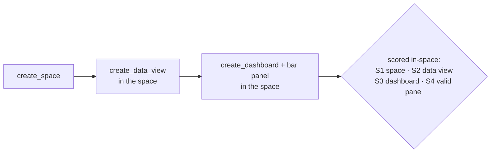
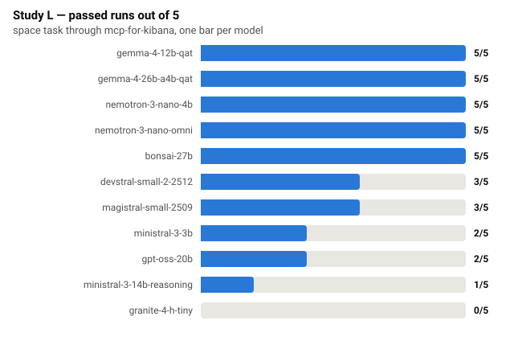
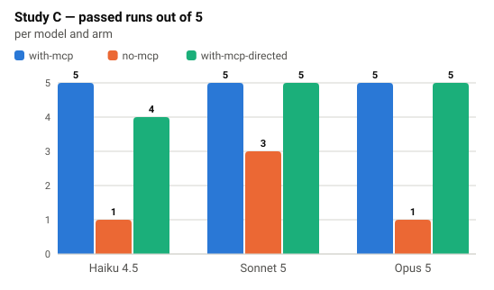
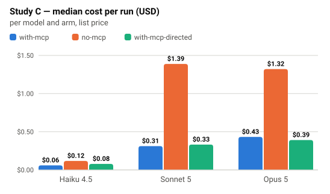

# Server usability by models — and what it costs

Can a model drive mcp-for-kibana through a real multi-step task, and what
does the same task cost a capable agent with and without the server?
Measured 2026-08-16 on one machine: Apple Silicon, 64 GB unified memory,
LM Studio 0.4.12, Kibana 9.4.3 from `scripts/stack.sh`, mcp-for-kibana at
the commit recorded in every run line.

The task, the pass criterion, and the analysis were frozen before any run.
Raw per-run records live in `scripts/experiment/runs/*.jsonl`; every table
and chart below is generated from them by `scripts/experiment/analyze.py`
and `scripts/experiment/charts.py` — nothing is hand-transcribed.

## The task

Create a Kibana space, then build a data view and a dashboard **inside**
it. The chain and the index pattern are stated deliberately: the studies
measure whether a model can **execute** a stated plan through the tools,
not whether it can derive the plan. `<space-id>` and `<marker>` are fresh
per run; every run gets a fresh space, is verified in-space, and is swept
afterwards.



### The exact prompts

Study L (local models), verbatim:

> Using the kibana tools, create a new Kibana space with id `<space-id>`.
> Inside that space, create a data view for the index pattern
> `kibana_sample_data_flights`, then create a dashboard titled
> `<marker> flight prices` with a bar chart of the average ticket price by
> carrier over the last 7 days, using that data view.

Study C (Claude agents), verbatim — one sentence of context, then the same
task; it deliberately names no URL, key, or header (a prompt that spells
out a curl recipe steers an agent past its registered tools):

> A local Kibana is available; its connection details are in the
> environment. Create a new Kibana space with id `<space-id>`. Inside that
> space, create a data view for the index pattern
> `kibana_sample_data_flights`, then create a dashboard titled
> `<marker> flight prices` with a bar chart of the average ticket price by
> carrier over the last 7 days, using that data view.

The `with-mcp-directed` arm prepends exactly:
*"Use your tools to do the following. "*

`<space-id>` is `e2e-<model-slug>-<8 hex>`; `<marker>` is `E2E <8 hex>` —
both fresh per run.

### Tool surface and scoring

**24 tools**: `dashboards`, `data-management`, and `platform-admin` at
`KIBANA_MCP_TIER=write` (the destructive tier stays hidden; the models
never see `delete_space`). Every dashboards and data-management tool
carries the optional `space` parameter
([space targeting](tools.md#space-targeting)).

A run passes when all four ladder rungs hold (S1 space exists, S2 a data
view in the space resolves the flights index, S3 a marker dashboard exists
in the space, S4 its panel is a bar chart of average `AvgTicketPrice` by
`Carrier`); failures are classified at the first missing rung. A
**contamination check** records marker-bearing objects in the *default*
space — it separates "built it in the wrong space" from "built nothing".
Every Study C run had **zero permission denials** (checked mechanically
from the CLI's own accounting), so no Claude result is an artefact of a
harness refusing something; Study L records LM Studio's client-side schema
rejections per run instead.

## Study L — can local models drive the server?

Eleven local models through LM Studio, five runs each, model loaded once
per block (load time recorded separately — it is not run time). Total run
time (sum of per-run durations) for all 55 runs: 103 minutes.



| Model | Passed (95% CI) | Load s | Run seconds | Failure classes |
|---|---|--:|---|---|
| `openai/gpt-oss-20b` | 2/5 [0.05, 0.85] | 5 | 51 / 27 / 29 / 23 / 26 | s2_data_view (wrong space: built in default) |
| `google/gemma-4-12b-qat` | 5/5 [0.48, 1.00] | 3 | 79 / 48 / 62 / 67 / 110 | — |
| `google/gemma-4-26b-a4b-qat` | 5/5 [0.48, 1.00] | 9 | 40 / 29 / 44 / 48 / 40 | — |
| `mistralai/devstral-small-2-2512` | 3/5 [0.15, 0.95] | 5 | 83 / 66 / 18 / 19 / 58 | abort (runtime error) |
| `mistralai/ministral-3-3b` | 2/5 [0.05, 0.85] | 4 | 600 / 36 / 600 / 63 / 17 | abort (timeout); s3_dashboard |
| `nvidia/nemotron-3-nano-omni` | 5/5 [0.48, 1.00] | 7 | 258 / 172 / 185 / 154 / 222 | — |
| `prism-ml/bonsai-27b` | 5/5 [0.48, 1.00] | 6 | 80 / 231 / 80 / 72 / 87 | — |
| `mistralai/magistral-small-2509` | 3/5 [0.15, 0.95] | 4 | 208 / 157 / 40 / 45 / 48 | abort (runtime error) |
| `mistralai/ministral-3-14b-reasoning` | 1/5 [0.01, 0.72] | 10 | 218 / 296 / 166 / 492 / 305 | s1_space |
| `nvidia/nemotron-3-nano-4b` | 5/5 [0.48, 1.00] | 3 | 59 / 100 / 40 / 40 / 30 | — |
| `ibm/granite-4-h-tiny` | 0/5 [0.00, 0.52] | 1 | 13 / 10 / 21 / 19 / 9 | s3_dashboard |

### What Study L supports

**Five models execute the whole space chain on every run** — the two
mid-size gemmas, `nemotron-3-nano-omni`, `bonsai-27b`, and, notably,
`nemotron-3-nano-4b` (2.84 GB): the smallest passing model runs the full
create-space → data-view → dashboard chain 5/5. Size does not predict
success: `granite-4-h-tiny` (4.23 GB) reaches the space and its data view
yet never lands a dashboard on any run.

**The characteristic failure is wrong-space, not no-dashboard.**
`gpt-oss-20b` creates the space correctly, then drops the `space`
parameter mid-chain and builds everything in the default space on 3 of 5
runs. The contamination check catches all three (the misplaced objects'
presence is recorded; their content is not scored). Threading one
parameter through a chain of calls is its own capability, distinct from
tool-call discipline.

**Failure classes are model-specific.** `devstral` shows stochastic
tool-call corruption (2 aborts at ~19 s — LM Studio's
`tool_format_generation_error` per the driver log; the committed records
carry the abort timing); `ministral-3-3b` alternates instant passes with
600 s stalls; `ministral-3-14b-reasoning` mostly fails at the very first
rung — it reasons at length and never lands a well-formed `create_space`.

## Study C — what the same task costs a capable agent

Three Claude models drive a real coding agent (`claude -p`, CLI 2.1.233)
against the same Kibana and the same frozen task, each run in a fresh
empty directory with the agent's full toolset. The arms differ in exactly
one thing:

| Arm | mcp-for-kibana registered | Prompt |
|---|:--:|---|
| `with-mcp` | yes | the task, nothing else |
| `no-mcp` | no | the task, nothing else |
| `with-mcp-directed` | yes | task, opening "Use your tools to…" |

Five blocks of all 9 cells, arm order rotated per block. 45 runs, $24.17
total, zero permission denials.





Medians per cell:

| Model | Arm | Passed (95% CI) | Turns | Tool calls | MCP calls | USD | Seconds | Denials |
|---|---|---|--:|--:|--:|--:|--:|--:|
| `claude-haiku-4-5` | with-mcp | 5/5 [0.48, 1.00] | 7 | 6 | 4 | 0.059 | 31 | 0 |
| `claude-haiku-4-5` | no-mcp | 1/5 [0.01, 0.72] | 15 | 14 | 0 | 0.117 | 71 | 0 |
| `claude-haiku-4-5` | with-mcp-directed | 4/5 [0.28, 0.99] | 10 | 9 | 4 | 0.078 | 44 | 0 |
| `claude-opus-5` | with-mcp | 5/5 [0.48, 1.00] | 12 | 11 | 7 | 0.432 | 46 | 0 |
| `claude-opus-5` | no-mcp | 1/5 [0.01, 0.72] | 30 | 29 | 0 | 1.321 | 261 | 0 |
| `claude-opus-5` | with-mcp-directed | 5/5 [0.48, 1.00] | 9 | 8 | 6 | 0.391 | 42 | 0 |
| `claude-sonnet-5` | with-mcp | 5/5 [0.48, 1.00] | 8 | 7 | 5 | 0.312 | 55 | 0 |
| `claude-sonnet-5` | no-mcp | 3/5 [0.15, 0.95] | 36 | 35 | 0 | 1.388 | 247 | 0 |
| `claude-sonnet-5` | with-mcp-directed | 5/5 [0.48, 1.00] | 8 | 7 | 5 | 0.332 | 56 | 0 |

### What Study C supports

**With the server registered, every model passes every run — including
Haiku.** 15/15 across `with-mcp`, at 6–11 tool calls following the stated
chain. Directing the model to use its tools changed nothing for the
capable models and cost Haiku one run.

**Without the server, the barrier is the hand-authored panel.** All
**10 of 10** `no-mcp` failures score `s4_panel` — the agent creates the
space, the data view, and a dashboard by raw API, then cannot author a
Lens panel the pass criterion accepts. (The one other failure in the study
is Haiku's single `with-mcp-directed` miss, at `s2_data_view`.)

What the server saves — each cell shows the two medians and their ratio,
`no-mcp` vs `with-mcp`:

| Median, no-mcp vs with-mcp | Haiku 4.5 | Sonnet 5 | Opus 5 |
|---|---|---|---|
| Turns | 15 vs 7 → **2.1×** | 36 vs 8 → **4.5×** | 30 vs 12 → **2.5×** |
| Cost (USD) | 0.117 vs 0.059 → **2.0×** | 1.388 vs 0.312 → **4.5×** | 1.321 vs 0.432 → **3.1×** |
| Wall clock (s) | 71 vs 31 → **2.3×** | 247 vs 55 → **4.5×** | 261 vs 46 → **5.7×** |

And the ratio understates the difference: the multiplied `no-mcp` spend
mostly buys a *failing* dashboard. Opus without the server spent up to
**$2.16 and 434 s in 34 turns** on a single run and still failed the panel
criterion, where the same model with the server passed in ~46 s for $0.43.

## Caveats

- One machine, one Kibana version, five runs per cell. The intervals above
  are wide; treat directions as solid and ratios as approximate.
- The prompt states the chain and the index pattern — data discovery and
  task planning are out of scope by design.
- A twelfth roster model (`google/gemma-4-31b-qat`) never loaded on this
  64 GB machine at its default context and is excluded; the refusal is in
  the run records.
- Loaded context is operator-controlled per local model (LM Studio
  default: the model's maximum) and recorded per run.
- Quantised builds (`-qat`) may behave differently from full-precision
  weights.
- Study C costs are list price at measurement date, from the CLI's own
  accounting; caching dominates the input side.
- The Study C agent had an unrestricted shell in every arm, deliberately,
  so no permission refusal could distort the comparison.

## Reproducing

One-time setup in [Testing & E2E](e2e-setup.md), plus
`KIBANA_MCP_TOOLBOXES=dashboards,data-management,platform-admin` on the LM
Studio server entry. Then:

```bash
make stack-start && make stack-seed
scripts/experiment/run_study_l.sh            # Study L, all models
scripts/experiment/run_study_c.sh            # Study C, all 45 cells
uv run python scripts/experiment/analyze.py  # the tables above
uv run python scripts/experiment/charts.py   # the charts above
```

Single cells: `LMSTUDIO_MODEL=<id> uv run pytest tests/e2e/test_lmstudio_space.py -m e2e -q`
or `uv run python scripts/experiment/claude_arm.py --model <id> --arm with-mcp --runs 1`.
